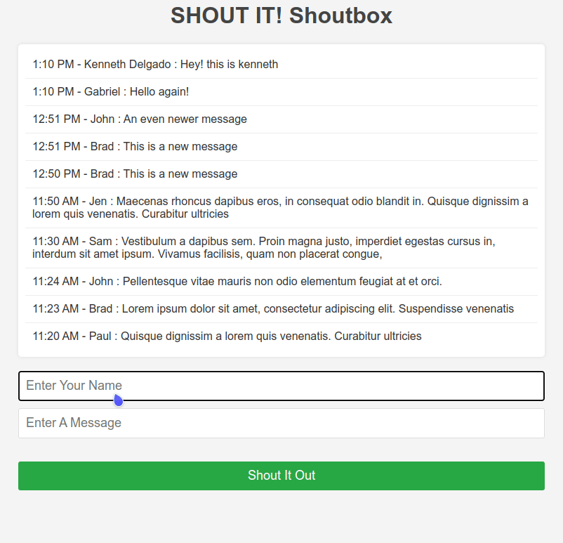

#
# ShoutIt App 📢 | PHP Application with Docker, Nginx, and MySQL

Welcome to **ShoutIt**. This project showcases my expertise in **web development** using **PHP 7**, **MySQL**, **Nginx**, and **Docker** to build, deploy, and manage php web applications. The app allows users to post and view short messages ("shouts")


## 🖼️ Screenshot



---

## Key Features 🚀

- **Dockerized Development**: Streamlined setup and deployment using Docker Compose.
- **Nginx Server**: Integrated for reverse proxy and PHP-FPM for fast backend processing.
- **Database Management**: Utilized MySQL for secure and optimized data handling.
- **phpMyAdmin**: Integrated for an easy-to-use graphical interface to manage and monitor the MySQL database.

---

## Technical Stack 💻

- **Backend**: PHP 7 with PHP-FPM for efficient request handling.
- **Database**: MySQL for data storage and management.
- **Frontend**: HTML5/CSS3 for a clean user interface.
- **Deployment**: Docker & Docker Compose for containerization and orchestration.
- **Web Server**: Nginx for handling static content and forwarding requests.

---

## Setup Instructions 🛠️

1. **Clone the Repository**:

   ```bash
   git clone https://github.com/yourusername/shoutit.git
   cd shoutit
   ```

2. **Configure Environment**:

   ```bash
   cp .env.example .env
   ```

3. **Build and Run**:

   ```bash
   docker-compose up -d --build
   ```

4. **Access the App**: Visit [http://localhost:8000](http://localhost:8000).

---

## Skills Demonstrated 🌟

- **Docker Expertise**: Containerized the application for simplified deployment and scalability.
- **Performance Optimization**: Leveraged Nginx and PHP-FPM for efficient server performance.
- **Database Security**: Implemented secure SQL practices to manage user data effectively.

---

## Connect With Me 🌐


- **GitHub**: [kenvastolord](https://github.com/kenvastolord)
- **LinkedIn**: [Kenneth Delgado](https://linkedin.com/in/kenneth-delgado-g)


I am eager to explore opportunities in **full-stack development**, **DevOps**. Feel free to reach out for collaboration or inquiries!
